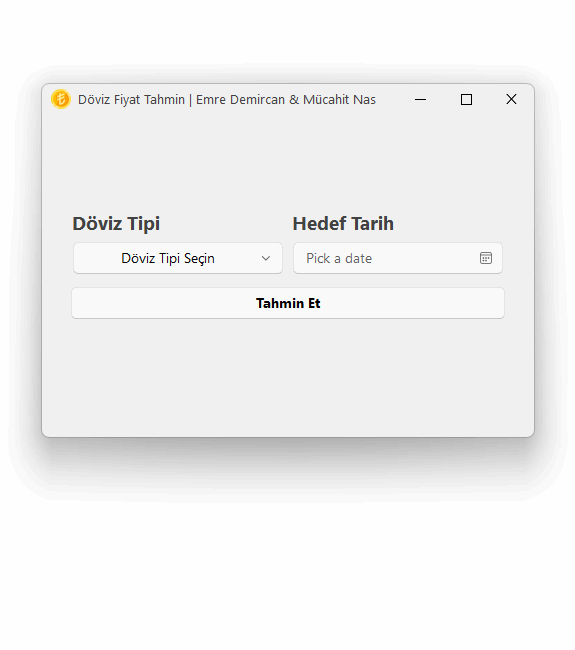

<p align="center">
  
</p>
  <h1 align="center">
  Currency Price Prediction Application
</h1>
<p align="center">
  This application allows users to select a currency type and target date to predict future exchange rates using artificial intelligence. The predictions are made based on a TensorFlow-based dense neural network model trained on historical data.
</p>

<p align="center">

  <a style="text-decoration:none">
    
  </a>

  <a style="text-decoration:none">
    
  </a>

  <a style="text-decoration:none">
    
  </a>
  
  <div align="center">
    
  [](README.md)
  </div>
</p>

## Demo
<div align="center">
  <div style="display:inline">
  
    
  **Dollar Price Prediction**
  </div>
  <div>
    
  </div>
</div>

<div align="center">
  <div style="display:inline">
  
    
  **Euro Price Prediction**
  </div>
  <div>
    
  </div>
</div>


## Installation
1. Install the requirements:

    ```shell
    pip install -r requirements.txt
    ```

2. Run the interface:
      ```shell
    cd app
    python main.py
    ```

## License

DovizTahmin is licensed under the MIT license.

Copyright © 2024 by emrecpp & MMucahit


## ⭐ If you like the project, don't forget to star it ⭐ 
