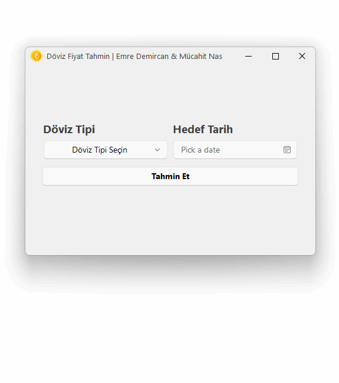
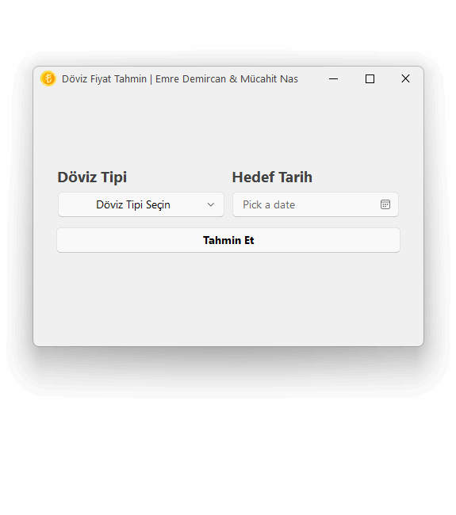

<p align="center">
  
</p>
  <h1 align="center">
  Döviz Fiyat Tahmin Uygulaması
</h1>
<p align="center">
  Bu uygulama, kullanıcıların döviz tipi ve hedef tarih seçerek yapay zeka ile gelecekteki kurları tahmin etmelerini sağlar. Tahminler, geçmiş verilere dayalı TensorFlow tabanlı yoğun sinir ağı modeliyle yapılır.
</p>

<p align="center">

  <a style="text-decoration:none">
    
  </a>

  <a style="text-decoration:none">
    
  </a>

  <a style="text-decoration:none">
    
  </a>
  
  <div align="center">
    
  [](README.en.md)
  </div>
</p>

## Demo
<div align="center">
  <div style="display:inline">
  
    
  **Dolar Fiyat Tahmini**
  </div>
  <div>
    
  </div>
</div>

<div align="center">
  <div style="display:inline">
  
    
  **Euro Fiyat Tahmini**
  </div>
  <div>
    
  </div>
</div>


## Kurulum
1. Gereksinimlerin yüklenmesi:

    ```shell
    pip install -r requirements.txt
    ```

2. Arayüzün çalıştırılması:
      ```shell
    cd app
    python main.py
    ```

## Lisans

DovizTahmin MIT lisansı altındadır.

Copyright © 2024 by emrecpp & MMucahit


## ⭐ Eğer projeyi beğendiyseniz yıldız atmayı unutmayın ⭐ 
